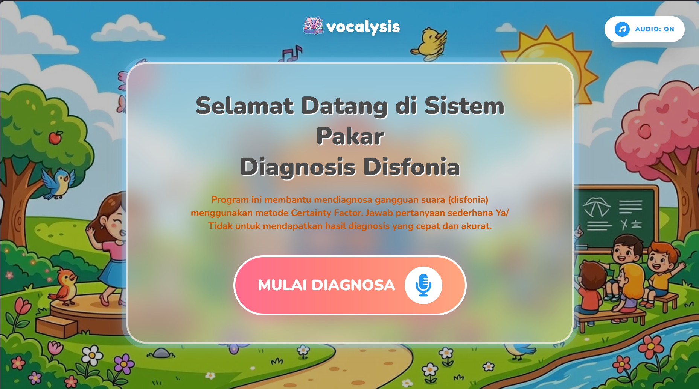
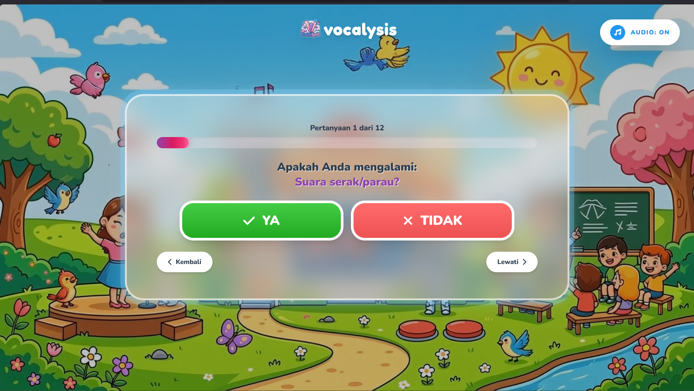
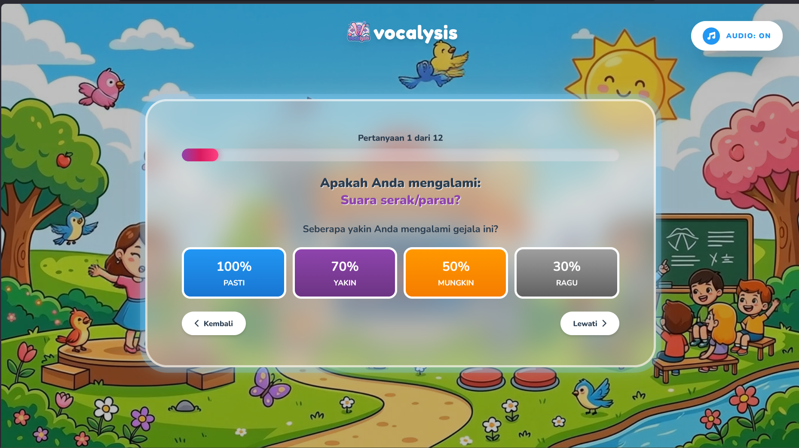
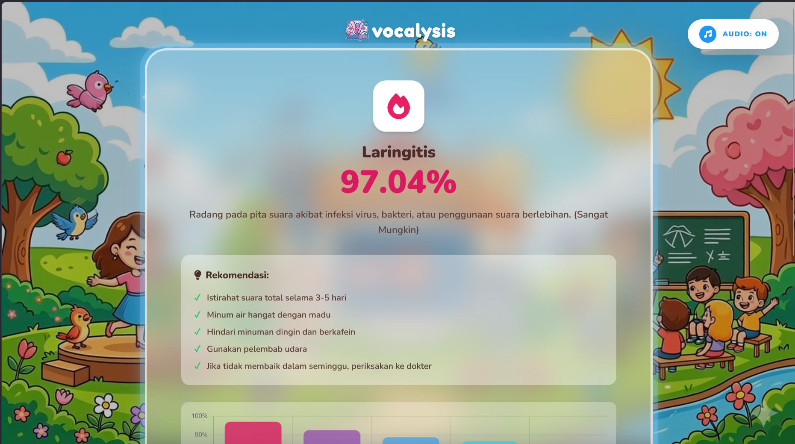
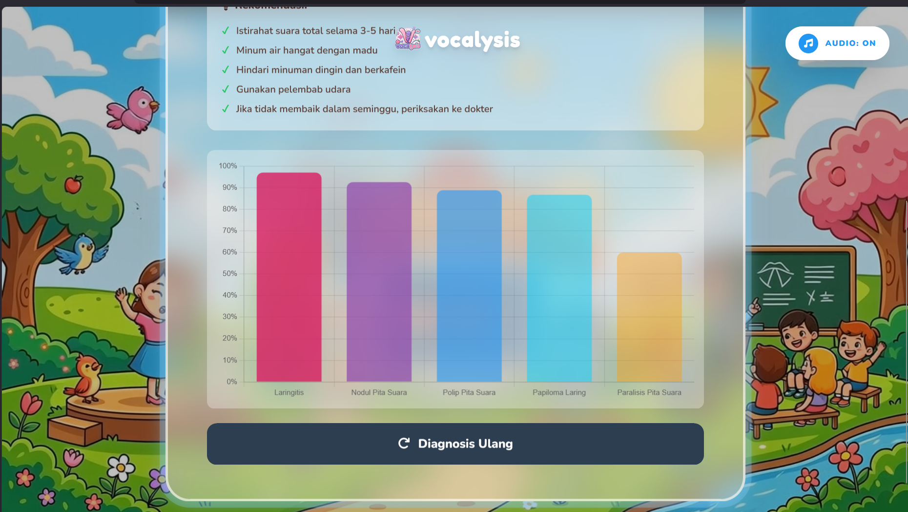

# 🎤 Sistem Pakar Diagnosis Gangguan Suara (Disfonia)

Sistem pakar berbasis web untuk mendiagnosis gangguan suara (disfonia) menggunakan metode **Certainty Factor** dengan **Forward Chaining**.

---

## 📋 Daftar Isi

- [Deskripsi](#deskripsi)
- [Fitur](#fitur)
- [Teknologi](#teknologi)
- [Metode Certainty Factor](#metode-certainty-factor)
- [Struktur Proyek](#struktur-proyek)
- [Instalasi & Menjalankan](#instalasi--menjalankan)
- [Cara Penggunaan](#cara-penggunaan)
- [Screenshot](#screenshot)
- [Daftar Gejala](#daftar-gejala)
- [Daftar Penyakit](#daftar-penyakit)
- [API Endpoints](#api-endpoints)
- [Kontributor](#kontributor)

---

## 📝 Deskripsi

Sistem pakar ini dirancang untuk membantu mendiagnosis berbagai jenis gangguan suara (disfonia) berdasarkan gejala yang dialami pengguna. Sistem menggunakan metode **Certainty Factor (CF)** untuk menangani ketidakpastian dalam diagnosis dan **Forward Chaining** untuk melakukan inferensi dari gejala ke penyakit.

### Cara Kerja:
1. Pengguna menjawab pertanyaan tentang gejala yang dialami
2. Untuk setiap gejala yang "Ya", pengguna memilih tingkat keyakinan:
   - **Pasti** (100%)
   - **Yakin** (70%)
   - **Mungkin** (50%)
   - **Ragu** (30%)
3. Sistem menghitung CF dan menampilkan hasil diagnosis dengan persentase keyakinan

---

## ✨ Fitur

- 🎯 **Diagnosis Cerdas** dengan metode Certainty Factor
- 📊 **Visualisasi Data** dengan Chart.js
- 🎨 **UI Modern** dengan Tailwind CSS
- 🎵 **Background Music** dengan kontrol on/off
- 🎬 **Background Video** animasi
- 📱 **Responsive Design** untuk mobile dan desktop
- 🔗 **REST API** untuk integrasi
- 📈 **Grafik Hasil Diagnosis**

---

## 🛠️ Teknologi

### Backend:
- **Python 3.x**
- **Flask** - Web framework
- **Flask-CORS** - Cross-origin resource sharing

### Frontend:
- **HTML5**
- **Tailwind CSS** - Styling
- **Chart.js** - Visualisasi data
- **Font Awesome** - Ikon

---

## 🧮 Metode Certainty Factor

Certainty Factor (CF) adalah metode untuk menangani ketidakpastian dalam sistem pakar.

### Rumus CF:
```
CF(H,E) = CF(E) × CF(Pakar)

CF Kombinasi = CF1 + CF2 × (1 - CF1)
```

### Interpretasi CF:
| Nilai CF | Interpretasi |
|----------|--------------|
| 0.8 - 1.0 | Sangat Mungkin |
| 0.6 - 0.8 | Mungkin |
| 0.4 - 0.6 | Cukup Mungkin |
| 0.2 - 0.4 | Kurang Mungkin |
| 0.0 - 0.2 | Tidak Pasti |

---

## 📁 Struktur Proyek

```
program-sistem-pakar/
├── app.py                 # Backend Flask
├── index.html             # Frontend
├── requirements.txt       # Dependencies
├── logo_transparent.png   # Logo aplikasi
├── background.mp4         # Background video
├── audio.mp3              # Background music
└── README.md              # Dokumentasi ini
```

---

## 🚀 Instalasi & Menjalankan

### 1. Clone Repository
```bash
git clone https://github.com/isvara08/responsi-kb-sistem-pakar.git
cd responsi-kb-sistem-pakar
```

### 2. Buat Virtual Environment
```bash
python -m venv .venv
.venv\Scripts\activate  # Windows
# atau
source .venv/bin/activate  # Linux/Mac
```

### 3. Install Dependencies
```bash
pip install -r requirements.txt
```

### 4. Jalankan Server
```bash
python app.py
```

### 5. Buka Browser
```
http://localhost:5000
```

---

## 📖 Cara Penggunaan

1. **Halaman Utama** - Klik tombol "MULAI DIAGNOSA"
2. **Jawab Pertanyaan** - Pilih "YA" atau "TIDAK" untuk setiap gejala
3. **Pilih Keyakinan** - Jika "YA", pilih tingkat keyakinan:
   - Pasti (100%)
   - Yakin (70%)
   - Mungkin (50%)
   - Ragu (30%)
4. **Lihat Hasil** - Sistem akan menampilkan:
   - Penyakit yang terdeteksi
   - Persentase keyakinan
   - Deskripsi penyakit
   - Rekomendasi penanganan
   - Grafik perbandingan hasil

---

## 📸 Screenshot

### 1. Halaman Utama

*Tampilan halaman utama dengan animasi background dan tombol mulai diagnosis*

### 2. Proses Diagnosis - Step 1 (Ya/Tidak)

*Pengguna menjawab apakah mengalami gejala tertentu*

### 3. Proses Diagnosis - Step 2 (Tingkat Keyakinan)

*Jika menjawab "Ya", pengguna memilih tingkat keyakinan gejala*

### 4. Hasil Diagnosis

*Tampilan hasil diagnosis dengan persentase CF dan rekomendasi*

### 5. Grafik Hasil

*Visualisasi perbandingan hasil diagnosis dalam bentuk grafik*

---

## 🏥 Daftar Gejala

| Kode | Gejala |
|------|--------|
| G1 | Suara serak/parau |
| G2 | Suara mudah pecah/putus saat bicara |
| G3 | Terasa sakit atau tidak nyaman saat bicara |
| G4 | Batuk kering terus-menerus |
| G5 | Ada rasa mengganjal di tenggorokan |
| G6 | Suara lebih berat/rendah dari biasanya |
| G7 | Cepat lelah saat berbicara/bernyanyi |
| G8 | Sering membersihkan tenggorokan |
| G9 | Sulit menjangkau nada tinggi |
| G10 | Suara bergetar/tremor |
| G11 | Demam ringan |
| G12 | Pilek/hidung tersumbat |

---

## 🏥 Daftar Penyakit

| Kode | Penyakit | Deskripsi |
|------|----------|-----------|
| NPS | Nodul Pita Suara | Pertumbuhan jinak pada pita suara |
| PPS | Polip Pita Suara | Benjolan berisi cairan pada pita suara |
| KV | Kelelahan Vokal | Kelelahan otot laring akibat penggunaan suara intensif |
| LA | Laringitis Akut | Radang akut pada pita suara |
| DL | Disfonia Functional | Gangguan suara tanpa kelainan anatomis |
| LR | Laringitis Kronis | Radang kronis pada pita suara |
| RL | Refluks Laringofaringeal | Iritasi akibat asam lambung |
| PPSV | Papilomatosis Laringis | Pertumbuhan tumor jinak berbentuk kutil |

---

## 🔌 API Endpoints

| Endpoint | Method | Deskripsi |
|----------|--------|-----------|
| `/` | GET | Halaman utama |
| `/api/gejala` | GET | Daftar semua gejala |
| `/api/penyakit` | GET | Daftar semua penyakit |
| `/api/diagnosis` | POST | Melakukan diagnosis |
| `/api/rules` | GET | Melihat basis aturan |
| `/api/test` | GET | Test status API |

### Contoh Request Diagnosis:
```json
POST /api/diagnosis
{
    "symptoms": {
        "G1": 1.0,
        "G2": 0.7,
        "G3": 0.5
    }
}
```

### Contoh Response:
```json
{
    "success": true,
    "primary_diagnosis": {
        "disease": "Nodul Pita Suara",
        "code": "NPS",
        "cf_value": 0.82,
        "cf_percentage": 82,
        "interpretation": "Sangat Mungkin",
        "description": "Pertumbuhan jinak pada pita suara...",
        "recommendations": ["Istirahatkan suara", "..."]
    },
    "all_results": [...]
}
```

---

## 👨‍💻 Kontributor

- **Nama:** Isvara
- **NIM:** (isi NIM)
- **Mata Kuliah:** Praktikum Kecerdasan Buatan
- **Tugas:** Responsi - Sistem Pakar dengan Certainty Factor

---

## 📚 Referensi

- Durkin, J. (1994). *Expert Systems: Design and Development*
- Giarratano, J., & Riley, G. (2004). *Expert Systems: Principles and Programming*
- Ignizio, J. P. (1991). *Introduction to Expert Systems*

---

## 📄 Lisensi

Proyek ini dibuat untuk keperluan akademik - Praktikum Kecerdasan Buatan.

---

<p align="center">
  <b>🎓 Dibuat dengan ❤️ untuk Praktikum Kecerdasan Buatan 🎓</b>
</p>
